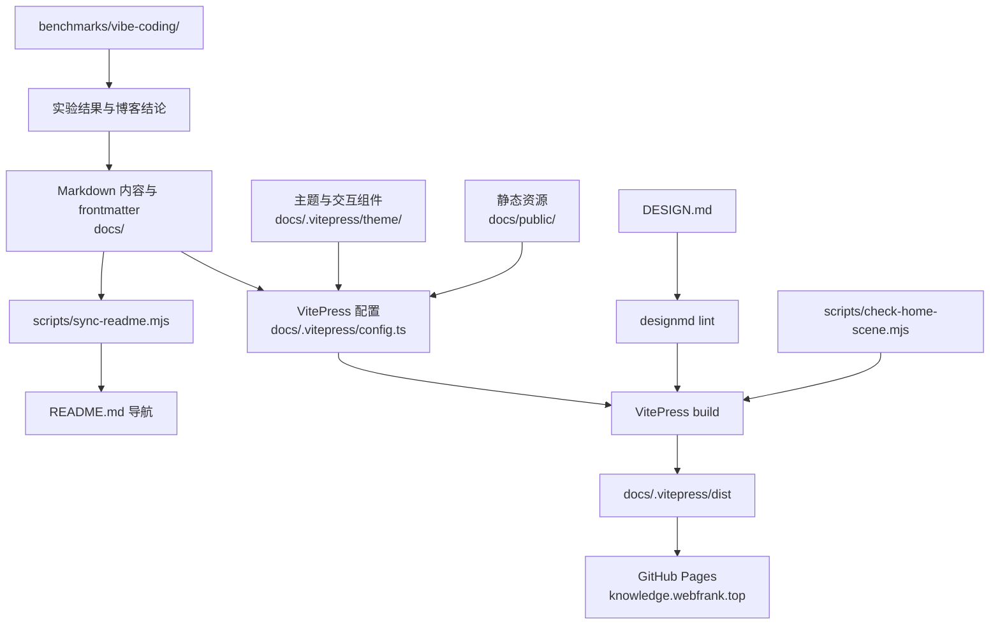

# System architecture

## 系统结构

## 边界与职责

- `docs/`：公开知识内容；按 AI 编程、AI Agent、Python 自动化、Web / React、RPA / Playwright、博客等主题组织。
- `docs/.vitepress/config.ts`：站点元数据、导航、侧边栏、搜索、分析与构建配置。
- `docs/.vitepress/theme/`：默认主题扩展、首页 Vue 组件、3D 场景与全局样式。
- `docs/public/`：直接发布的图片、视频、字体、CNAME、robots 等静态资产。
- `scripts/`：构建前同步与首页契约检查，以及文章插图生成辅助。
- `benchmarks/vibe-coding/`：可复核的 AI 编码评测子系统；与站点发布解耦。
- `.github/workflows/deploy.yml`：从 `main` 到 GitHub Pages 的发布边界，见 [[github-pages-custom-domain]]。

## 关键约束

- README 导航由 [[generated-readme-navigation]] 控制。
- 视觉实现受 [[design-system-build-gate]] 和 [[single-editorial-site-experience]] 约束。
- 生产输出只由构建生成，不直接修改 `docs/.vitepress/dist/`。
