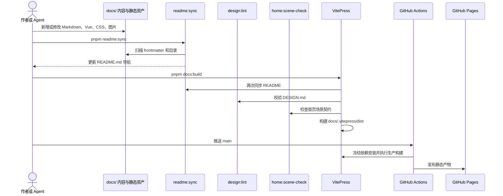

# Key flows

## 内容到发布的主流程

## 文章维护分支

1. 文章放入对应专题目录；长文默认进入 `docs/blog/`。
2. frontmatter 的 `title` 是导航生成和页面显示的共同输入。
3. 新文章默认加入首页“最新文章”；进入“推荐阅读”必须先由用户确认。
4. 插图遵守 [[design-system-build-gate]] 定义的生产与视觉验证要求。

## 基准研究分支

`benchmarks/vibe-coding/` 通过任务准备、运行、评分、复评与汇总脚本形成证据，再将结论写入公开博客；该策略见 [[repository-owned-agent-benchmark]]。
