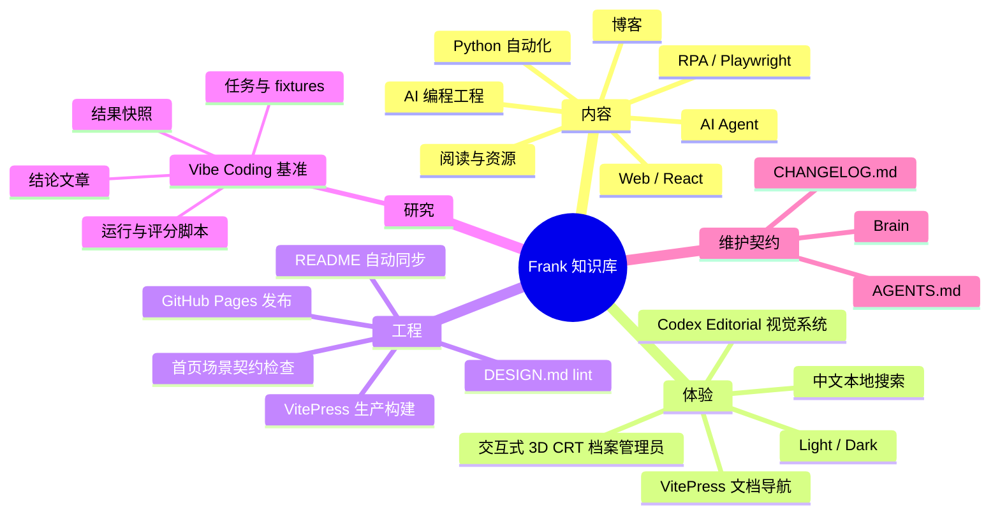

# Feature mindmap

## 主要知识关系

- 内容发现依赖 [[generated-readme-navigation]]。
- 站点视觉由 [[single-editorial-site-experience]] 定义方向，并由 [[design-system-build-gate]] 机械约束。
- 研究证据采用 [[repository-owned-agent-benchmark]] 的同仓模式。
- 公开发布采用 [[github-pages-custom-domain]]。
