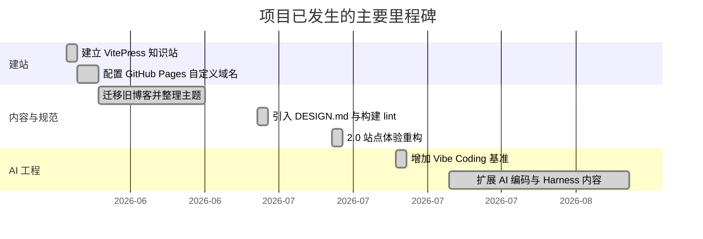

# Roadmap

## 已验证的演进轨迹

## 当前状态

- 知识站已具备内容分类、统一主题、本地搜索、自动导航、构建门禁和 GitHub Pages 发布链路。
- 内容持续扩展，近期重点明显集中在 AI 编码、Harness Engineering 与 Agent 工程。
- 首页交互已经过响应式与键盘可访问性增强。

## 待用户确认的未来路线

仓库没有可信的未来版本计划或发布日期，因此不把历史趋势当作承诺。以下问题保留待确认：

- 下一阶段优先扩充哪些主题，是否继续以 AI 编码 / Harness 为主？
- `benchmarks/vibe-coding/` 是否需要形成常态化复跑与版本化比较？
- 是否要为内容质量、搜索表现或读者反馈建立明确指标？
- 是否计划安装 Brain 的 pre-commit 与 Claude Code SessionStart hooks？
